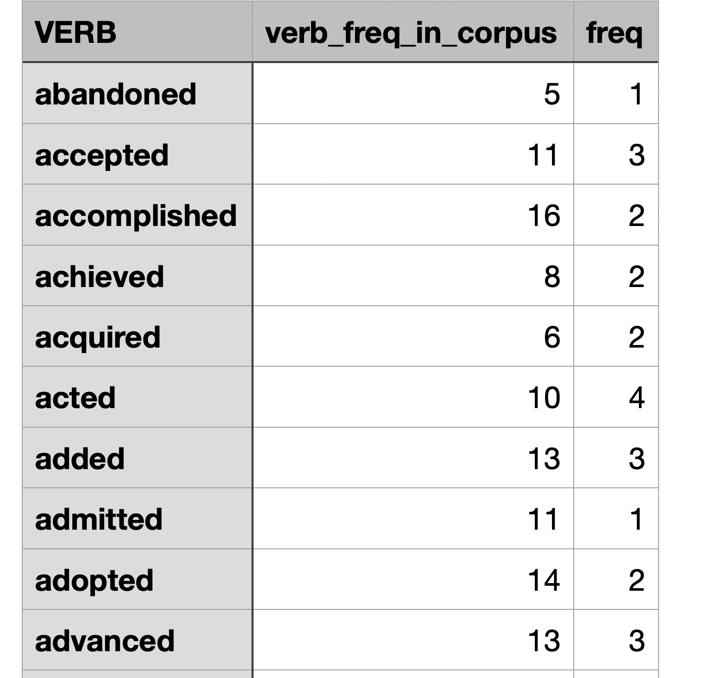
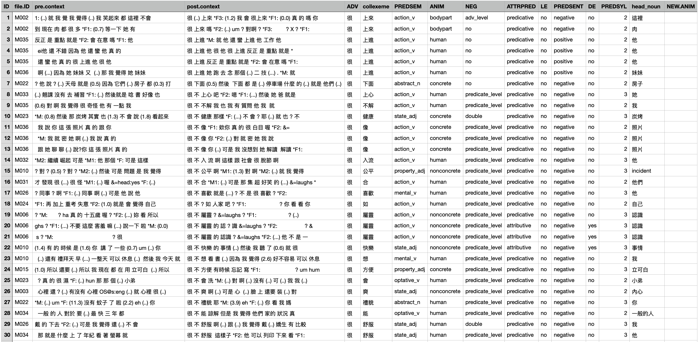

```{r include=F, purl=F}
## Rmarkdown settings
knitr::opts_chunk$set(message = F, warning = F)
knitr::opts_chunk$set(fig.width=8, fig.height=6, dpi=300, fig.retina=2, cols.print = 5)

## Automatically use showtext to render plots
## If loading showtext throws errors, install: https://www.xquartz.org/
library(showtext)
showtext_auto(enable = TRUE)
library(prettydoc)
## rmarkdown::render("collostruction_analysis.Rmd", html_pretty(theme="leonids", highlight="github", toc=T, number_sections=T, df_print="paged",css="static/style.css"), output_dir = "docs")
```

<p align="center">
  👉 <a href="https://mybinder.org/v2/gh/alvinntnu/Corpus_Linguistics_TU_Dresden/main?urlpath=rstudio" target="_blank" style="font-weight:bold;">
  Launch Tutorial in Binder
  </a>
</p>


# Loading packages

```{r}
library(tidyverse)
library(tidytext)
library(quanteda)
library(stringr)
library(jiebaR)
library(readtext)
```

# Objectives

In this tutorial, I would like to talk about the relationship between a construction and words. Words may co-occur to form **collocation** patterns. When words co-occur with a particular morphosyntactic pattern, they would form **collostruction** patterns.

Here I would like to introduce a widely-applied method for research on the meanings of constructional schemas---**Collostructional Aanalysis** [@stefanowitsch2003]. This is the major framework in corpus linguistics for the study of the relationship between words and constructions.

The idea behind collostructional analysis is simple: the meaning of a morphosyntactic construction can be determined very often by its co-occurring words.

In particular, words that are strongly associated (i.e., co-occurring) with the construction are referred to as **collexemes** of the construction.

**Collostructional Analysis** is an umbrella term, which covers several sub-analyses for constructional semantics:

-   **Collexeme** Analysis (cf. @stefanowitsch2003)
-   **Co-varying Collexeme** Analysis (cf. @stefanowitsch2005)
-   **(Multiple) Distinctive Collexeme** Analysis (cf. @gries2004)

This tutorial will first focus on **collexeme analysis**, whose principles can be extended to the other analyses.

Also, I will demonstrate how we can conduct a collexeme analysis by using the R script written by Stefan Gries ([Collostructional Analysis](http://www.stgries.info/teaching/groningen/index.html)).

# Corpus

As a demonstration, we use a pre-loaded corpus that comes with the `quanteda` package, `data_corpus_inaugural`. This is a corpus of US presidential inaugural address texts, and metadata for the corpus from 1789 to present.

We begin by looking at this preloaded corpus data:

```{r}
data_corpus_inaugural
class(data_corpus_inaugural)
```

# Objective

Let's assume that we are interested in the use of *Perfect* aspect in English by different presidents. We can try to extract Perfect constructions (including Present/Past Perfect) from each sentence using the regular expression.

Here we make a simple naive assumption: Perfect constructions include all `have/has/had + ...-en/ed` tokens from the sentences.

# Preprocessing

```{r purl=T}
## Load Data
corpus_df <-
  data.frame(text = as.character(data_corpus_inaugural)) %>% ## loading data
  mutate(doc_id = row_number()) ## create index

head(corpus_df)
```

::: try

Raw texts often contain unwanted characters such as invisible **control codes**, **extra spaces**, or **duplicate line breaks**.

These can interfere with segmentation accuracy. It is therefore a good idea to clean the texts before tokenization.

Here we used a simple function, `normalize_document()`, but you can always design a more specialized version for your own data.

:::

- Define how we would like to preprocess the data:

```{r}
## Text normalization function
## Define a function
normalize_document <- function(texts) {
  texts %>%
    str_replace_all("\\p{C}", " ") %>%  ## remove control chars
    str_replace_all("[\\s|\\n]+", " ") %>%  ## replace whitespaces/linebreaks with one whitespace
    trimws
}
```

- An example:

```{r}
## Example usage of `normalize_document()`
## before cleaning
corpus_df$text[1]
## after cleaning
normalize_document(corpus_df$text[1])
```

- Preprocess all texts in the corpus

```{r}
## Apply cleaning to all docs
corpus_df$text <- normalize_document(corpus_df$text)
```

```{r echo=F, purl=F}
corpus_df %>%
  head(100) %>%
  mutate(text = str_sub(text, 0,100) %>% sprintf("%s...",.))
```


:::{.alert}

In this example we did not add POS tags in order to keep things simple.
For actual research, POS information can be very useful for retrieving constructions more accurately. You may therefore want to utilize other existing POS taggers for more sophisticated preprocessing (e.g., `[spacyr](https://cran.r-project.org/web/packages/spacyr/vignettes/using_spacyr.html)`).

:::


# Extract Constructions

With segmented texts, we can now extract our target construction: Perfect Aspect Constructions. using a regular expression and `unnest_tokens()`.

:::{.info}

Both [regular expressions](https://en.wikipedia.org/wiki/Regular_expression) and [corpus query languages](https://www.sketchengine.eu/documentation/corpus-querying/) share the idea of pattern matching. They let you describe a search pattern in a formal way and then scan through text to find all the places where that pattern occurs. In both cases, you write rules instead of manually searching, which makes them powerful for handling large amounts of data.

The key difference is that regex patterns work only on surface strings, while corpus query languages extend this logic to structured linguistic information.
:::


- Define the constructional pattern:

```{r purl=T}
## Define regex
pattern_perfect <- "ha(d|ve|s) \\w+(en|ed)\\b"

```

- Extract the patterns from the corpus

```{r}
## Extract patterns
corpus_perfect <- corpus_df %>%
  unnest_tokens(
    output = construction, ## name for new unit
    input = text, ## name of old unit
    token = function(x) ## unnesting function
      str_extract_all(x, pattern = pattern_perfect)
  )

```

- Check the results

```{r}
## Print
corpus_perfect
```

# Exploratory/Descriptive Analysis

Usually before the statistical/quantitative analysis, we examine our data in an exploratory way.

```{r}
corpus_perfect %>%
  separate(construction, into = c("AUX","VERB")) %>%
  group_by(VERB) %>%
  summarize(freq = n(),
            docfreq = n_distinct(doc_id)) -> corpus_perfect_dist

corpus_perfect_dist %>% 
  arrange(-freq) %>%
  top_n(50, freq)
```

# Distributional Information Needed for Collostruction Analysis

To perform the **collexeme analysis**, which is essentially a statistical analysis of the association between words and a specific construction, we need to collect necessary distributional information of the words (`VERB`) and the construction (`AUX+VERB`).

In particular, to use Stefan Gries' R script of Collostructional Analysis, we need three types of frequency information:

1. Joint frequencies of each word with the construction.
2. Word frequencies in the entire corpus.
3. Total corpus size (number of tokens).

::: info

Example with the verb `given`:

- Joint frequency = number of times `AUX + given` occurs.
- Word frequency = total count of `given` in the corpus.
- Corpus size = total number of word tokens.

:::

## Word Frequency List

We start by creating a word frequency list for the corpus.

This involves converting the **text-based** data frame into a **word-based** one and counting token frequencies.

```{r purl=T}
## create word freq list
corpus_word_freq <- corpus_df %>%
  unnest_tokens( ## tokenization
    word,  ## new unit
    text,  ## old unit
    token = "words")  %>% ## remove empty strings
  count(word, sort = T)

corpus_word_freq %>%
  head(100)
```

::: alert
In the above example, when we convert our data frame from a text-based to a word-based one, we used the default tokenizer defined in `unnest_tokens()`, which is optimized for the English data.
:::

## Joint Frequencies

We now calculate the joint frequencies of the VERB and the AXU, namely the construction frequency of `AUX + given`.

Since we also have the word frequency list, we can link these counts together.


```{r purl=T}
## Joint frequency table

corpus_perfect_dist <- corpus_perfect_dist %>%
  mutate(verb_freq_in_corpus = corpus_word_freq$n[match(VERB, corpus_word_freq$word)])

corpus_perfect_dist
```

## Input for `coll.analysis.r`

Now we have almost all distributional information needed for the Collostructional Analysis.

Let's see how we can use Stefan Gries' script, `coll.analysis.r`, to perform the collostructional analysis on our data set.

Stefan Gries’ `coll.analysis.r` expects a **tab-delimited** file with three columns:

- Word
- Word frequency in the corpus
- Joint frequency with the construction


```{r purl=T}
## prepare a tsv
## for coll analysis
corpus_perfect_dist %>%
  select(VERB, verb_freq_in_corpus,freq) %>%
  write_tsv("perfect.tsv",col_names = FALSE)
```

```{r echo=F, out.width="40%"}

```


::: alert
Be sure to save the input as a **TSV** (tab-delimited) file, not **CSV**.
The script will not accept comma-delimited input.
:::

## Corpus Size

In addition to the input file, Stefan Gries' `coll.analysis.r` also requires a few general statistics for the computing of association measures.

We prepare necessary distributional information for the later collostructional analysis:

1.  Corpus size: The total number of words in the corpus
2.  Construction size: the total number of the construction tokens in the corpus

Later when we run Gries' script, we need to enter these numbers manually in the terminal.

```{r purl=T}
## corpus information
cat("Corpus Size: ", sum(corpus_word_freq$n), "\n")
cat("Construction Size: ", sum(corpus_perfect_dist$freq), "\n")
```

------------------------------------------------------------------------

::: try

Sometimes you may want to save console output for later use.

The function `sink()` redirects printed output to a file.

```{r purl=T, results=F, collapse=T}
## save info in a text
sink("perfect_info.txt") ## start flushing outputs to the file not the terminal
cat("Corpus Size: ", sum(corpus_word_freq$n), "\n")
cat("Construction Size: ", sum(corpus_perfect_dist$freq), "\n")
sink() ## end flushing
```

This will create a file `perfect_info.txt` in your working directory with the saved results.

:::


# Running Collostructional Analysis

We are now ready to run the analysis by sourcing [`coll.analysis.r`](https://www.stgries.info/teaching/groningen/index.html), available on Stefan Gries’ website.


```{r eval=F, echo=T, purl=T}
######################################
##      Preloading Gries' Functions ##
######################################
source("https://www.stgries.info/teaching/groningen/coll.analysis.r")


## Run the interactive analysis
coll.analysis()
```

------------------------------------------------------------------------

The script runs interactively, asking you to provide the required information.

For our example, the answers would be:

- `Analysis to perform`: 1
- `Name of construction`: PF
- `Corpus size`: `r sum(corpus_word_freq$n)`
- `Fisher-Yates`: no
- `Tab-delimited input data`: `perfect.tsv`

------------------------------------------------------------------------

If everything runs correctly, you will get a tab-delimited CSV output file in your working directory with the results.

# Interpretations

The output is a tab-delimited file with statistics for each candidate collexeme.

A sample result file is available in the root directory `2025-10-XX XX-XX-XXXX.csv`.

- We load the results and check the top collexemes:

```{r purl=T}

## convert into CSV
collo_table<-read_tsv("2026-01-10 05-09-16.359215.csv")

## auto-print
collo_table %>%
  filter(RELATION =="attraction") %>%
  arrange(desc(LLR)) %>%
  head(50) %>%
  select(WORD, LLR, everything())
```

The output includes several useful **COLLSTRENGTH** measures, specifying the association between the collexemes and the slot of the construction (`AUX + ______ `).

- LLR/PMI
- Log Odds Ratio
- Delta P
- Kullback-Leibler Divergence (KLD)

------------------------------------------------------------------------

With these statistics, we can identify the strongest collexemes according to different measures.

Here we focus on the top 10 collexemes by four metrics:


1.  `QL`: joint frequency of word and construction
2.  `DELTAPC2W`: delta P (construction → word)
3.  `DELTAPW2C`: delta P (word → construction)
4.  `LLR`: log-likelihood ratio

```{r out.height = "100%", purl=T}
## from wide to long
collo_table %>%
  filter(RELATION == "attraction") %>%
  filter(PF >=5) %>%
  select(WORD,PF, 
         DELTAPC2W, 
         DELTAPW2C,
         LLR) %>%
  pivot_longer(cols=c("PF", 
                      "DELTAPC2W", 
                      "DELTAPW2C",
                      "LLR"),
               names_to = "METRIC",
               values_to = "STRENGTH") %>%
  mutate(METRIC = factor(METRIC, 
                         levels = c("PF", 
                                   "DELTAPC2W",
                                   "DELTAPW2C",
                                   "LLR"))) %>%
  group_by(METRIC) %>%
  top_n(10, STRENGTH) %>%
  ungroup %>%
  arrange(METRIC, desc(STRENGTH)) -> coll_table_long

## plot
coll_table_long %>%
    mutate(WORD = reorder_within(WORD, within= METRIC, by=STRENGTH)) %>%
    ggplot(aes(WORD, STRENGTH, fill=METRIC)) +
    geom_col(show.legend = F) +
    scale_fill_brewer(palette = "Dark2") +
    coord_flip() +
    facet_wrap(~METRIC,scales = "free") +
    tidytext::scale_x_reordered() + 
    labs(x = "Collexemes",
         y = "Strength",
         title = "Collexemes Ranked by Different Metrics")
```

The bar plots above show the top 10 collexemes based on four different metrics: `QL`, `DELTAPC2W`, `DELTAPW2C`, and `LLR`.

:::{.alert}

Please review the assigned readings for details on how **collostructional strengths** are calculated.

In particular, @stefanowitsch2003 explains why Fisher’s exact test-based measures provide advantages over raw frequency counts.

Also note that **delta P** is a directional association measure that has been increasingly used in psycholinguistic research (see @ellis2006; @gries2013).

It is important to understand both how delta P is computed and how it should be interpreted.

:::


# Distinctive Collexeme Analysis

We can also use Stefan Gries’ script `coll.analysis.r` to perform a **Distinctive Collexeme Analysis**.

To illustrate this method, let’s use data from the following study:

> Huang, P. W., & Chen, A. C. H. (2022). Degree adverbs in spoken Mandarin: A behavioral profile corpus-based approach to language alternatives. *Concentric: Studies in Linguistics*, 48(2), 285–322.

In this work, the focus is on differences among four Mandarin degree adverbs: `很`, `蠻/滿`, `超`, and `太`.

As before, we run the interactive function `coll.analysis()`.  

For this example, the answers to the prompts would be:

-   `analysis to perform`: 2 (Distinctive Collexeme Analysis)  
-   `number of distinctive categories`: 2 (or more if there are 3+ alternatives)  
-   `tab-delimited input data`: `<demo_data/input-distcollexeme.tsv>`  

:::{.info}

For a **Distinctive Collexeme Analysis**, the input should be a data frame that lists each construction token in the corpus, with two key columns:

1. The **collexeme** (the co-occurring word)  
2. The **constructional element** (the construction category being compared)  

In our case, the constructional elements are the degree adverbs, and the collexemes are their co-occurring modifyees.  

The following figure shows how these were annotated in concordance lines:

```{r echo=F, out.width="100%"}

```

For Stefan’s script, we only need these two columns from the data: the collexemes and their associated constructional element.

```{r echo=F}
read_tsv(file = "demo_data/input-distcollexeme.tsv") %>%
  group_by(CONSTRUCTION) %>%
  sample_n(10) %>%
  ungroup
```

:::

------------------------------------------------------------------------

Once the script runs, it generates the results as a tab-delimited CSV file in the root directory.

An example output file is included in this project.

```{r}
### Distinctive Collexeme Analysis: Results Exploration
dist_results <- read_tsv("2025-10-02 04-10-56.334203.csv")

dist_results
```

:::{.info}

In *distinctive collexeme analysis*, the two columns mean:

**`SUMABSDEV`** shows how unevenly a word appears across the constructions. The larger this number, the more the word favors one construction over the others.

**`LARGESTPREF`** tells you *which* construction the word favors most — the one where it appears more often than expected.

So, if a collocate has a high `SUMABSDEV` and `LARGESTPREF = A`, it means the word occurs much more often in Construction A than chance would predict.

:::

And our next step is to explore the semantic patterns from the output:

```{r}
dist_results %>%
  group_by(LARGESTPREF) %>%
  top_n(10, SUMABSDEV) %>%
  select(COLLOCATE, SUMABSDEV, LARGESTPREF) %>%
  ungroup %>%
  arrange(LARGESTPREF) %>%
  mutate(COLLOCATE = reorder_within(COLLOCATE, within= LARGESTPREF, by=SUMABSDEV)) %>%
  ggplot(aes(COLLOCATE, SUMABSDEV, fill=SUMABSDEV)) +
    geom_col(show.legend = F) +
    scale_fill_distiller(palette="YlOrRd", direction=1)+
    coord_flip() +
    facet_wrap(~LARGESTPREF,scales = "free") +
    tidytext::scale_x_reordered() + 
    labs(x = "COLLOCATE",
         y = "STRENGTH(SUMABSDEV)",
         title = "DISTINCTIVE COLLEXEMES")

```

# References

