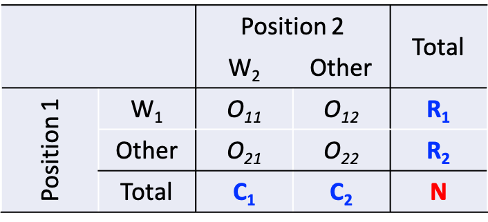
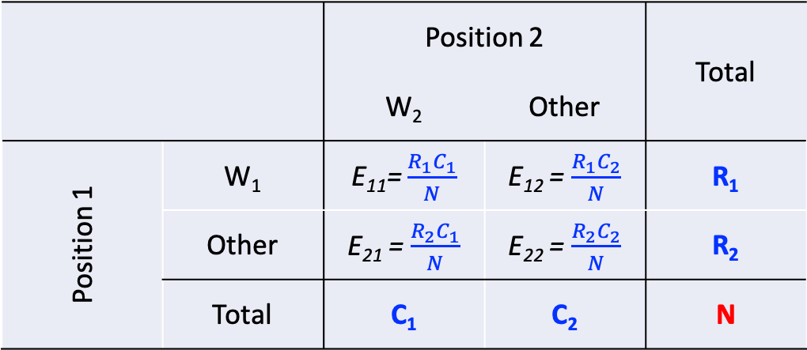
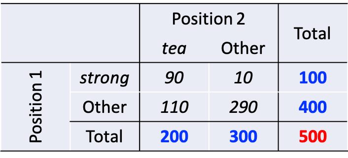
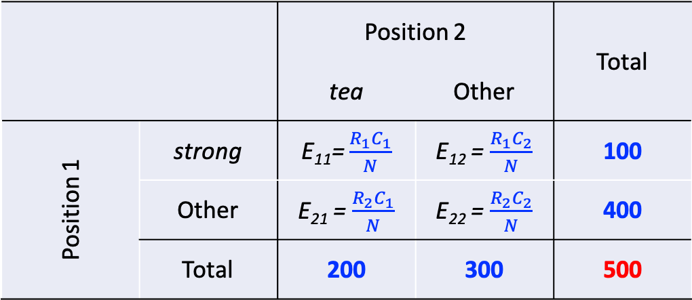
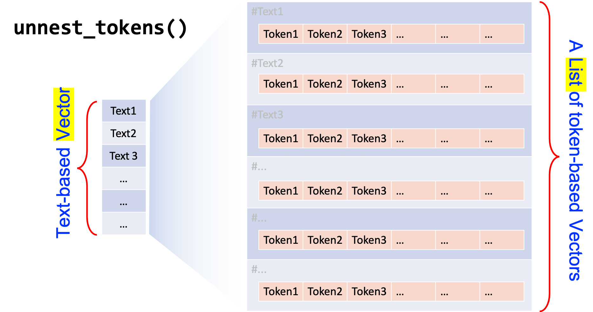

```{r include=F, purl=F}
## Rmarkdown settings
knitr::opts_chunk$set(message = F, warning = F)
knitr::opts_chunk$set(fig.width=8, fig.height=6, dpi=300, fig.retina=2, cols.print = 5)

## Automatically use showtext to render plots
## If loading showtext throws errors, install: https://www.xquartz.org/
library(showtext)
showtext_auto(enable = TRUE)
```

<p align="center">
  👉 <a href="https://mybinder.org/v2/gh/alvinntnu/Corpus_Linguistics_TU_Dresden/main?urlpath=rstudio" target="_blank" style="font-weight:bold;">
  Launch Tutorial in Binder
  </a>
</p>


# Corpus Analysis: A Start {#corpus-analysis-a-start}


In this tutorial, I will demonstrate how to perform a basic corpus analysis after you have collected data. I will show you some of the most common ways that people work with the text data.

# Environment Setting

## Installing `quanteda`

There are many packages that are made for computational text analytics in R. You may consult the [CRAN Task View: Natural Language Processing](https://cran.r-project.org/web/views/NaturalLanguageProcessing.html) for a lot more alternatives.

To start with, this tutorial will use a powerful package, `quanteda`, for managing and analyzing textual data in R. You may refer to the [official documentation of the package](https://quanteda.io/) for more detail.

`quanteda` is not included in the default R installation. Please install the package if you haven't done so.

```{r eval=F}
## core
install.packages("quanteda")
## data, model, plotting
install.packages("quanteda.textmodels")
install.packages("quanteda.textstats")
install.packages("quanteda.textplots")
## loadding texts
install.packages("readtext")
```


:::{.alert}
As noted on the `quanteda` documentation, because this library compiles some C++ and Fortran source code, you will need to have installed the appropriate compilers.

-   If you are using a Windows platform, this means you will need also to install the [Rtools](https://cran.r-project.org/bin/windows/Rtools/) software available from CRAN.
-   If you are using macOS, you should install the [macOS tools](https://cran.r-project.org/bin/macosx/tools/).

If you run into any installation errors, please go to the official documentation page for additional assistance.

:::


## Loading Libraries

```{r}
library(tidyverse)
library(quanteda)
library(quanteda.textplots)
library(quanteda.textstats)
library(readtext)
library(tidytext)

packageVersion("quanteda")
```

# Corpus Import

## Building a `corpus` from character vector

To demonstrate a typical corpus analytic example with texts, I will be using a pre-loaded corpus that comes with the `quanteda` package, `data_corpus_inaugural`. This is a corpus of US presidential inaugural address texts, and metadata for the corpus from 1789 to present.

```{r}
data_corpus_inaugural
class(data_corpus_inaugural)
```

We create a `corpus()` object with the pre-loaded `corpus` in `quanteda`-- `data_corpus_inaugural`:

```{r}
corp_us <- corpus(data_corpus_inaugural) # save the `corpus` to a short obj name
```

After the `corpus` is created, we can use `summary()` to get the metadata of each text in the corpus, including word types and tokens as well. This allows us to have a quick look at the size of the addressess made by all presidents.

```{r}
summary(corp_us)
```

:::{.info}
If you like to add document-level metadata information to each document in the `corpus` object, you can use `docvars()`. These document-level metadata information is referred to as `docvars` (document variables) in `quanteda`.

    docvars(corp_us, "country") <- "US"

The advantages of these `docvars` is that we can easily subset the corpus based on these document-level variables (i.e., a new corpus can be extracted/created based on logical conditions applied to `docvars`):

```{r}
corpus_subset(corp_us, Year > 2000) %>%
  summary
```

:::

```{r}
require(ggplot2)

corp_us %>%
  summary %>%
  ggplot(aes(x = Year, y = Tokens, group = 1)) +
    geom_line() +
    geom_point() +
    theme_bw()
```

------------------------------------------------------------------------

:::{.practice}
Could you reproduce the above line plot and add information of `President` to the plot as labels of the dots?
  
Hints: Please check `ggplot2::geom_text()` or more advanced one, `ggrepel::geom_text_repel()`
:::

```{r eval=T, echo=F}
require(ggrepel)
corp_us %>%
  summary %>%
  ggplot(aes(x = Year, y = Tokens, group = 1, label = President)) +
    geom_line(color = "darkgrey") +
    geom_point(aes(color = President)) +
    geom_text_repel(size = 2)+
    #geom_text(vjust = 4, angle = 0) +
    theme_bw() +
    scale_color_discrete(guide="none")

```

## Loading Own Corpus

* Core idea

  * Once you load text data into a character vector, you can create a `corpus` object directly with `quanteda::corpus()`.
  * This workflow keeps data handling simple and transparent.

* Loading external text data

  * The package `readtext` provides the function `readtext()` for importing text files.
  * The function supports many file formats and scales well to larger collections.
  * Consult the package documentation for extended usage and advanced options.

* Typical data organization

  * Researchers usually store all text files inside a single directory.
  * `readtext()` can import an entire directory in one step, which simplifies corpus construction.

* Example workflow

  * The file `gutenberg.zip` in the `demo_data` directory contains documents from Project Gutenberg.
  * The following code shows a complete workflow from import to corpus summary:


```{r}
gutenberg <- readtext(file = "demo_data/gutenberg.zip")
gutenberg_corp <- corpus(gutenberg)
summary(gutenberg_corp)
```


* Interpretation

  * `readtext()` reads the files into a structured text object.
  * `corpus()` converts this object into a quanteda corpus.
  * `summary()` provides a quick overview of documents, tokens, metadata.


# Tokenization

The first step for most textual analyses is usually tokenization, i.e., breaking each long text into word tokens for linguistic analysis. 

```{r}
corp_us_tokens <- tokens(corp_us)
corp_us_tokens[1]
```


# Keyword-in-Context (KWIC)

## KWIC

Keyword-in-Context (KWIC), or *concordances*, are the most frequently used method in corpus linguistics. The idea is very intuitive: we get to know more about the semantics of a word by examining how it is being used in a wider context.

We first tokenize the corpus using `tokens()` and then we can use `kwic()` to perform a search for a word and retrieve its concordances from the corpus:

```{r}
## concordances
kwic(corp_us_tokens, "terror")
```

`kwic()` returns a data frame, which can be easily exported to a CSV file for later use.

:::{.danger}
Please note that `kwic()`, when taking a `corpus` object as the argument, will automatically *tokenize* the corpus data and do the keyword-in-context search on a *word* basis. Yet, the recommended way is to tokenize the `corpus` object first with `tokens()` before you perform the concordance analysis with `kwic()`.

The pattern you look for cannot be a linguistic pattern across several words. We will talk about how to extract phrasal patterns/constructions later. Also, for languages without explicit word boundaries (e.g., Chinese), this may be a problem with `quanteda`. We will talk more about this in the later chapter on Chinese Texts Analytics.
:::

## KWIC with Regular Expressions

For more complex searches, we can use regular expressions as well in `kwic()`. For example, if you want to include `terror` and all its other related word forms, such as `terrorist`, `terrorism`, `terrors`, you can create a regular expression for the concordances.

```{r}
kwic(corp_us_tokens, "terror.*", valuetype = "regex") %>%
  data.frame
```

By default, the `kwic()` is word-based. If you like to look up a multiword combination, use `phrase()`:

```{r}
kwic(corp_us_tokens, phrase("our country")) %>%
  data.frame
```

It should be noted that the output of `kwic` includes not only the concordances (i.e., preceding/subsequent co-texts + the keyword), but also the sources of the texts for each concordance line. This would be extremely convenient if you need to refer back to the original discourse context of the concordance line.

:::{.info}

After a series of trial and error attempts, it seems that `phrase()` also supports regular expression search. If we want to extract the concordances of a multiword pattern defined by a regular expression, we can specify the regular expression on a **word** basis and change the `valuetype` to be `regex`.

It is less clear to me how we can use the regular expression to retrieve multiword patterns of variable sizes with `kwic()`.

```{r}
kwic(corp_us_tokens, 
     phrase("^(the|our)$ ^countr.+?$"), 
     valuetype = "regex") %>%
  data.frame
```

```{r}
kwic(corp_us_tokens, 
     phrase("^(be|was|were)$ ^(\\w+ly)$ ^(\\w+ed)$"), 
     valuetype = "regex") %>%
  data.frame
```

:::

------------------------------------------------------------------------

:::{.practice}
Please create a bar plot, showing the number of uses of the word *country* in each president's address. Please include different variants of the word, e.g., *countries*, *Countries*, *Country*, in your `kwic()` search.
:::

```{r eval=T, echo=F}
kwic(corp_us_tokens, "^[Cc]ountr(y|(ies))$", valuetype = "regex") %>%
  count(docname) %>%
  ggplot(aes(docname, n, fill = n)) +
  geom_bar(stat = "identity") +
  scale_fill_distiller(guide="none", palette = "YlGnBu") +
  labs(x = "Year and President ", y = "Number of `COUNTRY` Uses") +
  theme(axis.text.x = element_text(angle=90))
```


## Lexical Density Plot

Plotting a `kwic` object produces a lexical dispersion plot, which allows us to visualize the occurrences of particular terms throughout the texts.

```{r out.width="100%"}
corp_us_tokens %>%
  tokens_subset(Year > 1949) %>%
  kwic(pattern= "american") %>%
  textplot_xray()
```

```{r fig.width= 10, fig.height = 8}
## subset the corpus
corp_us_subset <- corp_us_tokens %>%
  tokens_subset(Year > 1949)

## Plotting
textplot_xray(kwic(corp_us_subset, pattern = "american"),
              kwic(corp_us_subset, pattern = "people")) +
  aes(color = keyword) + scale_color_manual(values = c('lightpink', 'royalblue'))
```


------------------------------------------------------------------------

# Tidy Text Format of the Corpus


* Current data format

  * Our corpus exists as a `corpus` object defined in `quanteda`.
  * Many R packages follow **tidy data principles** because this structure supports clearer, more efficient data handling.

:::{.info}
* Tidy data principles [@hadley2017]

  * Each variable appears in one column.
  * Each observation appears in one row.
  * Each type of observational unit forms one table.
:::

* Why this matters for corpus work

  * A `corpus` represents an abstract object.
  * A `data.frame` provides a more intuitive structure for human readers.
  * Converting a corpus into a tidy `data.frame` supports inspection, transformation, analysis.

* Tidy text format

  * Tidy text represents text data as a `data.frame` with one token per row.
  * A **token** refers to a meaningful unit of text used for analysis (e.g., words, sentences, paragraphs, documents)
  * **Tokenization** refers to the process of splitting text into tokens.
  * In computational text analysis, a token often corresponds to a single word.
  * Tokens can also represent n-grams, sentences, paragraphs.

* Working with tidy text in R

  * The `tidytext` package supports tidy text representations of corpus data.
  * With tidy text, you can use a shared ecosystem of tools such as `dplyr`, `tidyr`, `ggplot2` for data manipulation and visualization.
  * The function `tidy()` in `tidytext` converts a `quanteda` `corpus` into a document-based `data.frame`.


```{r}
library(tidytext)
corp_us_tidy <- tidy(corp_us) # convert `corpus` to `data.frame`
class(corp_us_tidy)
```

```{r echo=F}
require(stringr)
corp_us_tidy %>%
  mutate(text = str_sub(text, 1, 100) %>% str_c("..."))
```

# Processing Flowchart

```{r engpipe, purl= F, echo=F, out.width="90%", out.height="760px", fig.cap = "Computational Text Processing Flowchart"}
# Documentation: http://rich-iannone.github.io/DiagrammeR/graphviz_and_mermaid.html
DiagrammeR::grViz("digraph {
  
graph[layout = dot]

node[style=filled, color = grey90, penwidth = 0.3, fontcolor = grey30]
edge[color= grey40, alpha = 0.2, penwidth= 0.4, arrowsize=0.8, arrowhead = normal]

a [label = 'Raw Texts', shape = folder, fillcolor= '#B0E2FC']
a1 [label = 'corpus()', shape=document, fillcolor= '#96F597']
b [label = 'CORPUS object', shape = folder, fillcolor= '#B0E2FC']
b1 [label = 'tidytext::tidy()', shape=document, fillcolor= '#96F597']
b2 [label = 'quanteda::tokens()', shape=document, fillcolor= '#96F597']
b3 [label = 'quanteda::summary()', shape=document, fillcolor= '#96F597']
b4 [label = 'TOKENS object', shape = folder, fillcolor= '#B0E2FC']
b6 [label = 'quanteda::kwic()', shape=document, fillcolor= '#96F597']
b5[label = 'Data Frame (Summary)', shape = folder, fillcolor= '#B0E2FC']

b7[label = 'Data Frame (KWIC)', shape = folder, fillcolor= '#B0E2FC']

c [label = 'Data Frame (doc-based)', shape = folder, fillcolor= '#B0E2FC']
c1 [label = 'tidytext::unnest_tokens()', shape=document, fillcolor= '#96F597']
d [label = 'Data Frame(token-based)', shape = folder, fillcolor= '#B0E2FC']
d1 [label = 'dplyr', shape=document, fillcolor= '#96F597']
e [label = 'Word Frequency', shape = folder, fillcolor= '#B0E2FC']
f [label = 'N-gram Freuency', shape = folder, fillcolor= '#B0E2FC']
g [label = 'Constructions', shape = folder, fillcolor= '#B0E2FC']
h [label = 'Collocation', shape = folder, fillcolor= '#B0E2FC']

a -> a1 -> b -> b1 -> c -> c1 -> d -> d1
b->b2->b4->b6->b7
b->b3->b5
d1->e
d1->f
d1->g
e->h
f->h

}") -> flow_chart

flow_chart
```


# Frequency Lists

## Word (Unigram)

* Why tokenization matters

  * Word tokenization plays a central role in corpus analysis.
  * Words function as meaningful linguistic units.
  * Word frequency lists often signal key patterns, themes, semantic tendencies within documents.

* From text-based data to token-based data

  * The `tidytext` package offers the function `unnest_tokens()` for tokenization.
  * This function transforms a **text-based** data frame, each row as one document, into a **token-based** data frame, each row as one token.
  * This transformation supports fine-grained analysis such as frequency counts, collocation patterns, distributional analysis.

```{r}
corp_us_words <- corp_us_tidy %>%
  unnest_tokens(output = word,  # new unit column
                input = text,   # original text column
                token = "words") # tokenization method

corp_us_words
```

* Practical scope of `unnest_tokens()`

  * The function supports tokenization for English across several unit types.
  * Common options include words, ngrams, sentences, lines, paragraphs.
  * The help page `?unnest_tokens()` lists available settings.

* Important default behavior

  * `token = "words"` converts all text to lower case.
  * The function removes punctuation marks, numeric strings by default.
  * To preserve case, punctuation, numbers, specify extra arguments.

```r
unnest_tokens(..., token = "words", strip_punct = FALSE, strip_numeric = FALSE)
```

* Creating a word frequency list

  * The `dplyr` package provides the function `count()` for frequency calculation.
  * The following code counts word frequencies, then sorts results from high to low.

```{r}
corp_us_words_freq <- corp_us_words %>%
  count(word, sort = TRUE)

corp_us_words_freq
```


:::{.info}
The `unnest_tokens()` is optimized for English tokenization of smaller linguistic units, such as *words*, *ngrams*, *sentences*, *lines*, and *paragraphs* (check `?unnest_tokens()`). 
:::

## Bigrams

Frequency lists can be generated for bigrams or any other multiword combinations as well. The key is we need to convert the **text-based** data frame into a **bigram-based** data frame.

```{r}
corp_us_bigrams <- corp_us_tidy %>%
  unnest_tokens(
    output = bigram, # new base unit column name
    input = text, # original base unit column name
    token = "ngrams", # tokenization method
    n = 2
  )

corp_us_bigrams
```

To create bigram frequency list:

```{r}
corp_us_bigrams_freq <- corp_us_bigrams %>% 
  count(bigram, sort=TRUE)
corp_us_bigrams_freq

sum(corp_us_words_freq$n) # size of unigrams
sum(corp_us_bigrams_freq$n) # size of bigrams
```


:::{.practice}
Based on the bigram-based data frame, how can we create a frequency list showing each president's uses of bigrams with the first-person plural pronoun **we** as the first word. 

In the output, please present the most frequently used bigram in each presential addresss only. If there are ties, present all of them. 

Arrange the frequency list according to the year, the president's last name, and the token frequency of the bigram. 
:::

```{r echo=F, eval=T}
### Potential exercise
corp_us_bigrams %>%
  filter(str_detect(bigram, "^we\\s")) %>%
  unite(col = "YearPresident", Year, President) %>%
  #mutate(verb = str_replace_all(bigram, "^we\\s","")) %>%
  count(YearPresident, bigram, sort = TRUE) %>%
  group_by(YearPresident) %>%
  top_n(1, n) %>%
  ungroup %>%
  arrange(desc(YearPresident), desc(n)) %>%
  separate(YearPresident,
           into = c("Year", "President"),
           sep = "_")

```

:::{.practice}
The function `unnest_tokens()` does a lot of work behind the scene. Please take a closer look at the outputs of `unnest_tokens()` and examine how it takes care of the **case normalization** and **punctuations** within the sentence. Will these treatments affect the frequency lists we get in any important way? Please elaborate.
:::


```{r eval=F, echo=F}

sents <- c("I'm not interested in John's book.",
           "The U.S.A. is denoting $1,200 dollars.",
           "We're pretty sure: it's going to rain!")

tibble(ID = 1:length(sents), sents) %>%
  unnest_tokens(words, sents, token = "ngrams", n = 2)


myTokenizer <- function(x){
  str_split(x, pattern = "([^\\w\\s])|[\\n]+")
}

corp_us_tidy %>%
  mutate(INDEX = str_c(Year, President, sep = "_")) %>%
  unnest_tokens(chunk, text, token = myTokenizer) %>%
  group_by(INDEX) %>%
  mutate(CHUNK_ID = row_number()) %>%
  ungroup -> corp_us_chunk

corp_us_chunk %>%
  unnest_tokens(word, chunk, token = "words") -> corp_us_chunk_word
corp_us_chunk %>% 
  unnest_tokens(bigram, chunk, token = "ngrams", n=2) %>%
  filter(!is.na(bigram))-> corp_us_chunk_bigram
dim(corp_us_chunk_bigram)
dim(corp_us_chunk_word)
```

## Ngrams (Lexical Bundles)

```{r}
corp_us_trigrams <-  corp_us_tidy %>%
  unnest_tokens(trigrams, text, token = "ngrams", n = 3)

corp_us_trigrams
```

We then can examine which n-grams were most often used by each President:

```{r}
corp_us_trigrams %>%
  count(President, trigrams) %>%
  group_by(President) %>%
  top_n(3, n) %>%
  arrange(President, desc(n))
```

------------------------------------------------------------------------

:::{.practice}
Please subset the top 3 trigrams of President Don. Trump, Bill Clinton, John Adams, from `corp_us_trigram`.
:::

```{r echo=F}
corp_us_trigrams %>%
  count(President, trigrams) %>%
  group_by(President) %>%
  top_n(3, n) %>%
  filter(President %in% c("Trump","Clinton", "Adams")) %>%
  arrange(President, desc(n))
```

------------------------------------------------------------------------

## Frequency and Dispersion

When you examine frequency lists, another distributional metric deserves attention: **dispersion**. Dispersion captures how widely a form spreads across texts rather than how often it appears overall.

An n-gram with high frequency can reflect very different usage patterns. A form may appear many times within a single document, used by one particular President. The same frequency may instead reflect broad use across many documents, used by many Presidents. These two scenarios carry very different interpretive weight. Frequency gains significance when it co-occurs with wide dispersion.

For this reason, we now compute the `dispersion` of n-grams in `corp_us_trigrams`. Here, dispersion refers to the number of Presidents who used a given n-gram at least once in their address(es).

:::{.info}
Dispersion represents a central concept in corpus analysis. Researchers have proposed more refined quantitative measures to operationalize this construct. See @gries2021a for an overview.
:::


```{r}
# method 1
corp_us_trigrams %>%
  count(trigrams, President) %>%
  group_by(trigrams) %>%
  summarize(FREQ = sum(n), DISPERSION = n()) %>%
  filter(DISPERSION >= 5) %>%
  arrange(desc(DISPERSION))

# method2
corp_us_trigrams %>%
  group_by(trigrams) %>%
  summarize(FREQ = n(), DISPERSION = n_distinct(President)) %>%
  filter(DISPERSION >= 5) %>%
  arrange(desc(DISPERSION))

# Arrange according to frequency
# corp_us_trigram %>%
#   count(trigrams, President) %>%
#   group_by(trigrams) %>%
#   summarize(freq = sum(n), dispersion = n()) %>%
#   arrange(desc(freq))
```

In particular, cut-off values are often used to determine a list of meaningful n-grams. These cut-off values include: the **frequency** of the n-grams, as well as the **dispersion** of the n-grams. A subset of n-grams that are defined and selected based on these distributional criteria (i.e., frequency and dispersion) are often referred to as **Lexical bundles** (See @biber2004).

------------------------------------------------------------------------

:::{.practice}
Please create a list of four-word lexical bundles that have been used in at least FIVE different **presidential addressess**. Arrange the resulting data frame according to the frequency of the four-grams.
:::

```{r echo=F, eval=T}
corp_us_4grams <- corp_us_tidy %>%
  unnest_tokens(ngrams, text, token = "ngrams", n = 4) %>%
  mutate(ID = paste(Year, President, sep="_"))

# method1
# corp_us_4grams %>% 
#   count(ngrams, ID) %>%
#   group_by(ngrams) %>%
#   summarize(FREQ = sum(n), DISPERSION = n()) %>%
#   filter(DISPERSION >= 5) %>%
#   arrange(desc(FREQ))

# method2
corp_us_4grams %>% 
  group_by(ngrams) %>%
  summarize(FREQ = n(), DISPERSION = n_distinct(ID)) %>%
  filter(DISPERSION >= 5) %>%
  arrange(desc(FREQ))
```

------------------------------------------------------------------------

## Word Cloud

With frequency data, we can visualize important words in the corpus with a **Word Cloud**. It is a novel but intuitive visual representation of text data. It allows us to quickly perceive the most prominent words from a large collection of texts.

```{r}
library(wordcloud)
set.seed(123)
with(corp_us_words_freq, wordcloud(word, n, 
                                   max.words = 400,
                                   min.freq = 30,
                                   scale = c(2,0.5),
                                   color = brewer.pal(8, "Dark2"),
                                   vfont=c("serif","plain")))
```

------------------------------------------------------------------------

:::{.practice}
Word cloud would be more informative if we first remove functional words. In `tidytext`, there is a preloaded data frame, `stop_words`, which contains common English stop words. Please make use of this data frame and try to re-create a word cloud with all stopwords removed. (Criteria: Frequency >= 20; Max Number of Words Plotted = 400)


Hint: Check `dplyr::anti_join()`
:::


```{r}
require(tidytext)
stop_words
```

```{r echo=F, out.width="100%"}
set.seed(123)
corp_us_words_freq %>%
  anti_join(stop_words,by = "word") %>%
  with(wordcloud(word, n, 
                 max.words = 400, 
                 min.freq = 20, 
                 scale=c(2.3,0.3),
                 colors=brewer.pal(8, "Dark2"),
                 vfont=c("serif","plain")))
```

:::{.practice}
Get yourself familiar with another R package for creating word clouds, `wordcloud2`, and re-create a word cloud as requested in previous exercise but in a fancier format, i.e., a star-shaped one. (Criteria: Frequency >= 20; Max Number of Words Plotted = 400)
:::

```{r echo=F, eval=F, out.width="100%", out.height="100%"}
##, screenshot.force=T, screenshot.opts=list(delay=3)
require(wordcloud2)
corp_us_words_freq %>%
  anti_join(stop_words,by = "word") %>%
  filter(n >= 20) %>%
  top_n(400, n) %>%
  wordcloud2(shape = "star", size= 0.5)
# require(htmlwidgets)
# saveWidget(wc2,"wc2.html", selfcontained = F)
# webshot::webshot("wc2.html", "wc2.png", vwidth = 1024,vheight = 800, delay = 10)
#wc2
```

<!-- ```{r echo=F, eval=T, out.width="100%"} -->
<!-- knitr::include_graphics("wc2.png") -->
<!-- ``` -->

# Collocations

With unigram and bigram frequencies of the corpus, we can further examine the collocations within the corpus. **Collocation** refers to a frequent phenomenon where two words tend to co-occur very often in use. This co-occurrence is defined statistically by their *lexical associations*.

## Cooccurrence Table and Observed Frequencies

Cooccurrence frequency data for a word pair, *w~1~* and *w~2~*, are often organized in a contingency table extracted from a corpus, as shown below.

The cell counts of this contingency table are referred to as the **observed** frequencies *O~11~*, *O~12~*, *O~21~*, and *O~22~*.

------------------------------------------------------------------------

```{r collo1, eval=T, echo=F, out.width = "80%", fig.cap = "Cooccurrence Frequency Table"}

```

------------------------------------------------------------------------

The sum of all four observed frequencies (called the sample size *N*) is equal to the total number of bigrams extracted from the corpus.

And before we discuss the computation of lexical associations, there are a few terms that we often use when talking about the contingency table.

-   *R~1~* and *R~2~* are the row totals of the observed contingency table, while *C~1~* and *C~2~* are the corresponding column totals. These row and column totals are referred to as **marginal frequencies** (because they are often written on the margins of the table)
-   The frequency in *O~11~* is referred to as the **joint frequency** of the two words.

## Expected Frequencies

For every contingency table as seen above, if one knows the marginal frequencies (i.e., the row and column sums), one can compute the expected frequencies of the four cells accordingly. These expected frequencies would be the expected distribution under the *null hypothesis* that *W~1~* and *W~2~* are statistically independent.

And the idea of **lexical association** between *W~1~* and *W~2~* is to statistically access to what extent the **observed** frequencies in the contingency table are different from the **expected** frequencies (given the current the **marginal** frequencies).

Therefore, equations for different association measures (i.e., mutual information, log-likelihood ratios, chi-square) are often given in terms of the observed frequencies, marginal frequencies, and the expected frequencies *E~11~*, ..., *E~22~*.

:::{.info}
Please see Stefan Evert's [Computational Approaches to Collocation](http://www.collocations.de/AM/index.html) for a very detailed and comprehensive comparison of various statistical methods for lexical association.
:::

The expected frequencies can be computed from the marginal frequencies as shown below.

------------------------------------------------------------------------

```{r collo2, eval=T, echo=F, out.width = "95%", fig.cap = "Computing Expected Frequencies"}

```

------------------------------------------------------------------------

Maybe it would be easier for us to illustrate this with a simple example:

------------------------------------------------------------------------

```{r collo3, eval=T, echo=F, out.width = "95%", fig.cap = "Computing Expected Frequencies"}

```

------------------------------------------------------------------------

How do we compute the expected frequencies of the four cells?

------------------------------------------------------------------------

```{r collo4, eval=T, echo=F, out.width = "95%", fig.cap = "Computing Expected Frequencies"}

```

------------------------------------------------------------------------

```{r eval=T, echo=T}
example <- matrix(c(90, 10, 110, 290), byrow=T, nrow=2)
```


:::{.practice}
Please compute the expected frequencies for the above matrix `example` in R.
:::

```{r eval=T, echo=F}
example <- matrix(c(90, 10, 110, 290), byrow=T, nrow=2)
x <-chisq.test(example)$expected %>% as.data.frame
row.names(x) <- c("strong","OTHER")
names(x) <- c("tea","OTHER")
x
```

## Association Measures

```{r eval=T, echo=F, results='hide'}
getOption("scipen")
options(scipen=99999)
```

The idea of lexical assoication is to measure how much the observed frequencies deviate from the expected. Some of the metrics (e.g., *t-statistic*, *MI*) consider only the joint frequency deviation (i.e., *O~11~*), while others (e.g., *G^2^*, a.k.a Log Likelihood Ratio) consider the deviations of ALL cells.

Here I would like to show you how we can compute the two old-school association metrics for all two-word combinations found in the corpus: **t-test** statistic and **Mutual Information** (MI).

-   $t = \frac{O_{11}-E_{11}}{\sqrt{O_{11}}}$
-   $MI = log_2\frac{O_{11}}{E_{11}}$
-   $G^2 = 2 \sum_{ij}{O_{ij}log\frac{O_{ij}}{E_{ij}}}$

```{r}
corp_us_bigrams_freq %>% head(10)

corp_us_collocations <- corp_us_bigrams_freq %>%
  rename(O11 = n) %>%
  tidyr::separate(bigram, c("w1", "w2"), sep="\\s") %>% # split bigrams into two columns
  mutate(R1 = corp_us_words_freq$n[match(w1, corp_us_words_freq$word)],
         C1 = corp_us_words_freq$n[match(w2, corp_us_words_freq$word)]) %>% # retrieve w1 w2 unigram freq
  mutate(E11 = (R1*C1)/sum(O11)) %>% # compute expected freq of bigrams
  mutate(MI = log2(O11/E11),
         t = (O11 - E11)/sqrt(O11)) %>% # compute associations
  arrange(desc(MI)) # sorting
 

corp_us_collocations %>%
   filter(O11 > 5) # set bigram frequency cut-off
```

:::{.alert}
Please note that in the above example, we compute the lexical associations for bigrams whose frequency > 5. This is necessary in collocation studies because bigrams of very low frequency would not be informative even though its association can be very strong. However, the cut-off value can be arbitrary, depending on the corpus size or researchers' considerations.
:::

:::{.info}
How to compute lexical associations is a non-trivial issue. There are many more ways to compute the association strengths between two words. Please refer to [Stefan Evert's site](http://www.collocations.de/index.html) for a very comprehensive review of lexical association measures. Probably the recommended method is *G^2^* [@stefanowitsch2019].
:::


:::{.info}
The idea of "co-occurrence" can be defined in many different ways. So far, our discussion and computation of bigrams' collocation strength has been based on a very **narrow** definition of "co-occurrence", i.e., *w~1~* and *w~2~* have to be directly adjacent to each other (i.e., contiguous bigrams).

The co-occurrence of two words can be defined in more flexible ways:

- *w~1~* and *w~2~* co-occur within a defined window frame (e.g., -/+ ten-word window frame)
- *w~1~* and *w~2~* co-occur within a particular syntactic frame (e.g., Adjective + ... + Noun)

While the operationalization of co-occurrence may lead to different *w~1~* and *w~2~* **joint frequencies** in the above contingency table, the computation of the collocation metrics for the two words is still the same.
:::


------------------------------------------------------------------------

:::{.practice}
Sort the collocation data frame `corp_us_collocations` according to the `t-score` and compare the results sorted by `MI` scores. Please describe the differences between the bigram collocations found with both metrics (i.e., MI and t-score).
:::

* Collocations sorted by t-score:

```{r eval = T, echo = F}
corp_us_collocations %>%
  arrange(desc(t)) %>%
  filter(O11 > 5)
```

* Collocations sorted by MI values:

```{r eval = T, echo = F}
corp_us_collocations %>%
  arrange(desc(MI)) %>%
  filter(O11 > 5)
```

------------------------------------------------------------------------

:::{.practice}
Based on the formula provided above, please create a new column for `corp_us_collocations`, which gives the Log-Likelihood Ratios of all the bigrams.
:::

:::{.alert}
When you do the above exercise, you may run into a couple of problems:

- Some of the bigrams have `NaN` values in their LLR. This may be due to the issue of `NAs produced by integer overflow`. Please solve this.
- After solving the above overflow issue, you may still have a few bigrams with `NaN` in their LLR, which may be due to the computation of the `log` value. In Math, how do we define `log(1/0)` and `log(0/1)`? Do you know when you would get an undefined value `NaN` in the computation of `log()`?
- To solve the problems, please assign the value `0` if the `log` returns `NaN` values.
:::

```{r eval=T, echo=F}
# problems
# (1) integers overflow issues
# (2) NaN: This problem arises from: log(0/N) = -Inf, but 0*-Inf = NaN
LLR<-function(o11, o12, o21, o22, e11, e12, e21, e22) {
   s11<-ifelse(o11*log((o11/e11))=="NaN", 0, o11*log((o11/e11)))
   s12<-ifelse(o12*log((o12/e12))=="NaN", 0, o12*log((o12/e12)))
   s21<-ifelse(o21*log((o21/e21))=="NaN", 0, o21*log((o21/e21)))
   s22<-ifelse(o22*log((o22/e22))=="NaN", 0, o22*log((o22/e22)))
   return(2*sum(s11, s12, s21, s22))
}

LLR_V <- Vectorize(LLR)

corp_us_collocations %>%
  mutate_if(is.integer, as.numeric) %>%
  mutate(C2 = sum(O11)-C1,
         R2 = sum(O11)-R1,
         O12 = R1-O11,
         O21 = C1 - O11,
         O22 = C2 - O12,
         E12 = (R1*C2)/sum(O11),
         E21 = (R2*C1)/sum(O11),
         E22 = (R2*C2)/sum(O11),
         LLR = LLR_V(O11,O12,O21,O22,E11,E12,E21,E22)) %>%
  arrange(desc(LLR)) %>%
  select(w1,w2,MI, t, LLR,O11,O12,O21,O22,E11,E12,E21,E22)
```

------------------------------------------------------------------------


:::{.practice}

(A) Find the top FIVE bigrams ranked according to MI values for each president. The result would be a data frame as shown below. (Please remove bigrams whose frequency < 5 from before ranking.)

(B) Create a plot as shown below to visualize your results.

Please note that due to the ties of MI scores, there may be more than five bigrams presented in the results for each presidential address.
:::


```{r echo=F, fig.width = 8, fig.height = 12, out.width= "110%"}
# example for `ungroup`
# corp_us_bigrams %>%
#   tidyr::unite(Year_President, Year, President, sep = "_") %>%
#   group_by(Year_President, bigram) %>%
#   summarize(n = n()) %>%
#   ungroup %>%
#   filter(n >=2) %>% # set bigram frequency cut-off
#   tidyr::separate(bigram, c("w1", "w2"), sep ="\\s") %>%
#   mutate(w1freq = corp_us_words_freq$n[match(w1, corp_us_words_freq$word)],
#          w2freq = corp_us_words_freq$n[match(w2, corp_us_words_freq$word)]) %>%
#   mutate(w12freq_exp = (w1freq*w2freq)/sum(n)) %>%
#   mutate(MI = log2(n/w12freq_exp),
#          t = (n - w12freq_exp)/sqrt(n)) %>%
#   group_by(Year_President) %>%
#   top_n(5, MI) %>%
#   arrange(Year_President, desc(MI))


## Should compute the MI first  
corp_us_collocations <- corp_us_bigrams_freq %>%
  rename(O11 = n) %>%
  tidyr::separate(bigram, c("w1", "w2"), sep="\\s") %>% # split bigrams into two columns
  mutate(R1 = corp_us_words_freq$n[match(w1, corp_us_words_freq$word)],
         C1 = corp_us_words_freq$n[match(w2, corp_us_words_freq$word)]) %>% # retrieve w1 w2 unigram freq
  mutate(E11 = (R1*C1)/sum(O11)) %>% # compute expected freq of bigrams
  mutate(MI = log2(O11/E11),
         t = (O11 - E11)/sqrt(O11)) %>% # compute associations
  arrange(desc(MI)) %>% # sorting
  mutate(bigram = str_c(w1, w2, sep=" "))

corp_us_bigrams %>%
  tidyr::unite(Year_President, Year, President, sep = "_") %>%
  count(Year_President, bigram) %>%
  left_join(corp_us_collocations,by = c("bigram"="bigram")) %>%
  # tidyr::separate(bigram, c("w1", "w2"), sep ="\\s") %>%
  # mutate(w1freq = corp_us_words_freq$n[match(w1, corp_us_words_freq$word)],
  #        w2freq = corp_us_words_freq$n[match(w2, corp_us_words_freq$word)]) %>%
  # mutate(w12freq_exp = (w1freq*w2freq)/sum(n)) %>%
  # mutate(MI = log2(n/w12freq_exp),
  #        t = (n - w12freq_exp)/sqrt(n)) %>%
  # filter(n >=2) %>% # set bigram frequency cut-off
  filter(O11 > 5) %>%
  group_by(Year_President) %>%
  top_n(5, MI) %>%
  arrange(Year_President, desc(MI)) -> corp_us_collocations_president

corp_us_collocations_president

require(ggrepel)
corp_us_collocations_president %>%
  #filter(Year_President == "2017_Trump") %>%
  tidyr::unite(bigram, w1, w2, sep="_") %>%
  mutate(Year = str_extract(Year_President, pattern = "^\\d+")) %>%
  ggplot(aes(x = MI, y = Year, label = bigram, color = as.factor(Year))) +
  geom_point(size = 0.7, alpha = .6)+
  #geom_text(aes(label = bigram), check_overlap = F, vjust = 1.5, color = "grey10", alpha = .8, size =  1.6, angle = 30) +
  geom_text_repel(size= 2, alpha = .8, color = "grey10")+
  guides(color = "none") +
  scale_y_discrete(expand= expansion(add=2))
```


# Constructions

We are often interested in the use of linguistic patterns, which are beyond the lexical boundaries. My experience is that usually it is better to work with the corpus on a sentential level.

We can use the same tokenization function, `unnest_tokens()` to convert our **text-based** corpus data frame, `corpus_us_tidy`, into a **sentence-based** tidy structure:

```{r eval = T, echo = T}
corp_us_sents <- corp_us_tidy %>%
  unnest_tokens(output = sentence, ## nested unit
                input = text, ## superordinate unit
                token = "sentences") # tokenize the `text` column into `sentence`
corp_us_sents
```

With each sentence, we can investigate particular constructions in more detail.

Let's assume that we are interested in the use of *Perfect* aspect in English by different presidents. We can try to extract Perfect constructions (including Present/Past Perfect) from each sentence using the regular expression.

Here we make a simple naive assumption: Perfect constructions include all `have/has/had + ...-en/ed` tokens from the sentences.

```{r eval=T, echo=T}
require(stringr)
# Perfect
corp_us_sents %>%
  unnest_tokens(
    output = perfect,   ## nested unit
    input = sentence,  ## superordinate unit
    token = function(x)
      str_extract_all(x, "ha(d|ve|s) \\w+(en|ed)")
  ) -> result_perfect
result_perfect
```

:::{.info}
In the above example, we specify the `token = ...` in `unnest_tokens(..., token = ...)` with a self-defined function. 

The idea of tokenization in `unnest_tokens()` is that the `token` argument can be a function which takes a text-based **vector** as input (i.e, each element of the input vector may be a document text) and returns a **list**, each element of which is a token-based version (i.e., vector) of the original input vector element (see Figure below).

In our demonstration, we define a tokenization function, which takes `sentence` as the input and returns a list, each element of which consists a vector of tokens matching the regular expressions in individual sentences in `sentence`. 

(Note: The function object is not assigned to an object name, thus never being created in the R working session.)

------------------------------------------------------------------------

```{r constructionextraction, echo=F, out.width="90%", fig.cap = "Intuition for `token=` in `unnest_tokens()`"}

```

------------------------------------------------------------------------

:::


And of course we can do an exploratory analysis of the frequencies of Perfect constructions by different presidents:

```{r eval=T, echo=T}
require(tidyr)
# table
result_perfect %>%
  group_by(President) %>%
  summarize(TOKEN_FREQ = n(),
            TYPE_FREQ = n_distinct(perfect))

# graph
result_perfect %>%
  group_by(President) %>%
  summarize(TOKEN_FREQ = n(),
            TYPE_FREQ = n_distinct(perfect)) %>%
  pivot_longer(c("TOKEN_FREQ", "TYPE_FREQ"), names_to = "STATISTIC", values_to = "NUMBER") %>%
  ggplot(aes(President, NUMBER, fill = STATISTIC)) +
           geom_bar(stat = "identity",position = position_dodge()) +
  theme(axis.text.x = element_text(angle=90))
```

There are quite a few things we need to take care of more thoroughly:

1.  The auxiliary *HAVE* and the past participle do not necessarily have to stand next to each other for Perfect constructions.

2.  We now lose track of one important information: from which sentence of the Presidential addresses was each construction token extracted?

Any ideas how to solve all these issues? The following exercises will be devoted to these two important issues.

:::{.practice}
Please create a better regular expression to retrieve more tokens of English Perfect constructions, where the auxilliary and participle may not stand together.
:::

```{r eval=T, echo = F, out.width="90%"}
str_view_all(corp_us_sents$sentence ,"ha(d|ve|s) (\\w+ ){1,3}\\w+(en|ed)", html=T)
```

------------------------------------------------------------------------

:::{.practice}
Re-generate a `result_perfect` data frame, where you can keep track of:
  
  - From the *N*-th sentence of the address did the Perfect come? (e.g., `SENT_ID` column below)
  - From which president's address did the Perfect come? (e.g., `INDEX` column below)
  
You may have a data frame as shown below.
:::

```{r echo=F, eval= T}
corp_us_tidy %>%
  mutate(INDEX = str_c(Year, President,sep = "-")) %>%
  unnest_tokens(output = sentence, input = text, token = "sentences") %>%
  group_by(INDEX) %>%
  mutate(SENT_ID = row_number()) %>%
  ungroup %>%
  mutate(pattern = str_extract_all(sentence, "ha(d|ve|s) \\w+(en|ed)")) %>%
  unnest_tokens(perfect, pattern,token = c) %>%
  select(-sentence) -> result_perfect2
  
  result_perfect2
```

:::{.practice}
Re-create the above bar plot in a way that the type and token frequencies are computed based on each address and the x axis should be arranged accordingly (i.e., by the years and presidents). Your resulting graph should look similar to the one below.
:::

```{r eval=T, echo=F, fig.width=10, fig.height=6}
  result_perfect2 %>%
    group_by(INDEX) %>%
    summarize(TOKEN_FREQ = n(),
              TYPE_FREQ = n_distinct(perfect)) %>%
    pivot_longer(c("TOKEN_FREQ", "TYPE_FREQ"), names_to = "STATISTIC", values_to = "NUMBER") %>%
    ggplot(aes(INDEX, NUMBER, fill = STATISTIC)) +
           geom_bar(stat = "identity",position = position_dodge()) +
  theme(axis.text.x = element_text(angle=90))
```

```{r eval=F, echo=F}
corp_us_sents %>%
  #filter(str_detect(sentence, "")) %>%
  mutate(pattern = str_extract_all(sentence, "ha(d|ve|s) (\\w+ ){1,3}\\w+(en|ed)")) %>%
  unnest_tokens(tokens, pattern,token = c) %>%
  select(-sentence)


sents <- corp_us_sents$sentence

sents %>%
  str_extract_all("ha(d|ve|s) \\w+(en|ed)") %>% 
  unlist %>%
  unique
```

# Keyness Analysis

When you have two collections of texts, we can use quantitative methods to identify which words are more strongly associated with one of the two sub-corpora. This is the idea of **keyword analysis**.

```{r echo=T, out.width="100%", fig.width = 10, fig.height = 12}
# Only select speeches by Obama and Trump
pres_corpus <- corpus_subset(corp_us,
                            President %in% c("Trump", "Biden"))

# Create a dfm grouped by president
pres_dfm <- pres_corpus %>%
  tokens(remove_punct = T,
         remove_numbers= T,
         remove_symbols = T) %>%
  tokens_remove(stopwords("en")) %>%
  tokens_group(groups = President) %>%
  dfm(tolower=F) 

# Calculate keyness and determine Trump as target group
result_keyness <- textstat_keyness(pres_dfm, 
                                   target = "Biden",
                                   measure = "lr")

# Plot estimated word keyness
textplot_keyness(result_keyness,
                 color = c("red", "blue"), 
                 n = 30)
```


# References
