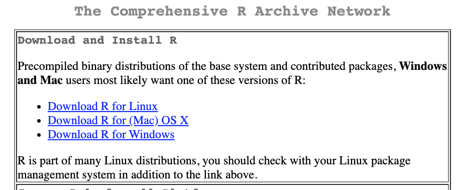
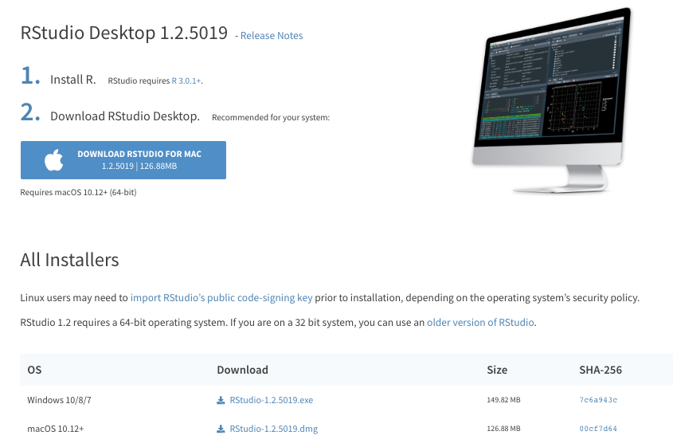
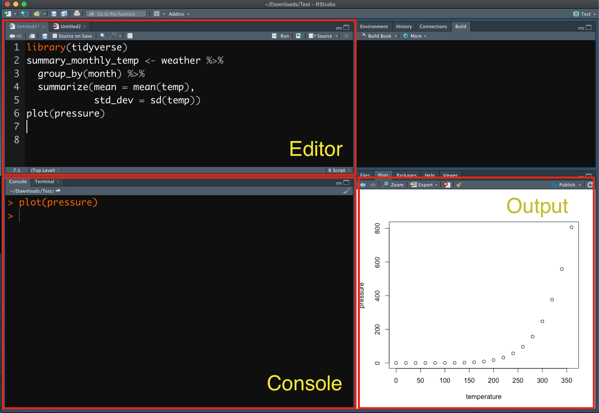
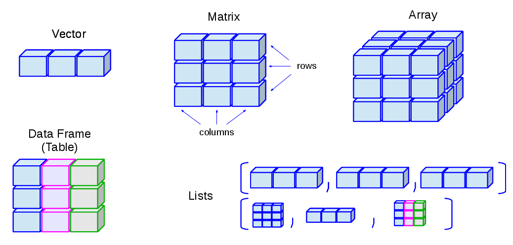
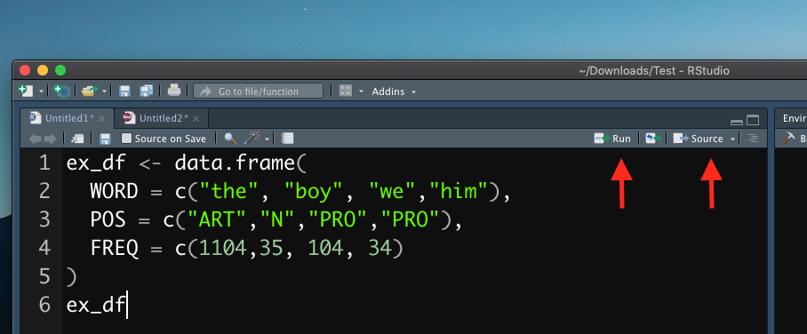
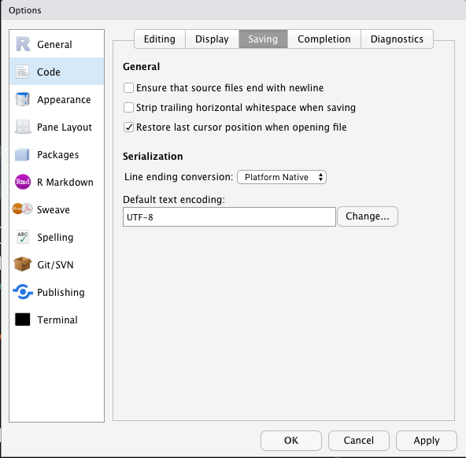
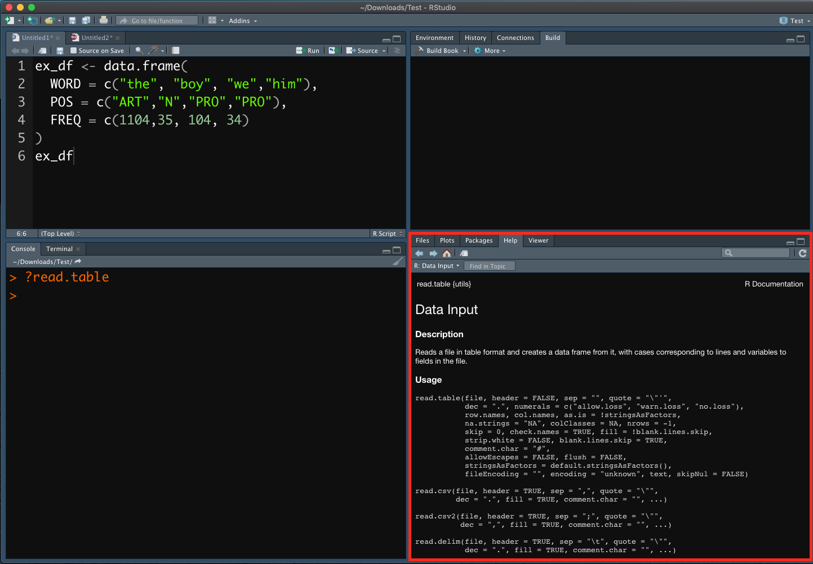

```{r include=F, purl=F}
## Rmarkdown settings
knitr::opts_chunk$set(message = F, warning = F)
knitr::opts_chunk$set(fig.width=8, fig.height=6, dpi=300, fig.retina=2, cols.print = 5)

## Automatically use showtext to render plots
## If loading showtext throws errors, install: https://www.xquartz.org/
library(showtext)
showtext_auto(enable = TRUE)

```

<p align="center">
  👉 <a href="https://mybinder.org/v2/gh/alvinntnu/Corpus_Linguistics_TU_Dresden/main?urlpath=rstudio" target="_blank" style="font-weight:bold;">
  Launch Tutorial in Binder
  </a>
</p>


# R Fundamentals: Environment Setting {#r-fundamentals}

- Download R: [R-Project](https://cloud.r-project.org) 
- IDE: [RStudio](https://www.rstudio.com/products/rstudio) 


## Installing R

Download the installation file: [http://cran.r-project.org](https://cloud.r-project.org)



 

## Installing RStudio

After you install R, you may install RStudio. RStudio is an editor which can help you write R codes. A good analogy is that R is the engine and Rstudio is the dashboard of the car.


```{r out.width = '50%', echo = FALSE, purl=F}
knitr::include_graphics(c("images/engine.png", "images/dashboard.png"))
```


Please download the right version that is compatible with your PC operating system.

- <https://www.rstudio.com/download>
- Choose `RStudio Desktop`

```{r out.width = '85%', echo = FALSE, purl=F}

```


:::{.alert}
- Important notes:
  - Do not have non-alphanumeric characters in your directory names or on the path to the files.
  - Do not have spaces and weird symbols in your file path:
    - `D:/R`
    - `D:/Rstudio`
    - `/User/Alvinchen/`
:::

## My Current Version


```{r}
sessionInfo()
```

## The Interface of Rstudio {#the-interface-of-rstudio}

When you start Rstudio, you will see an interface as follows:

```{r rstudiointerface, out.width = '75%', echo=FALSE, fig.cap = "Rstudio Interface", purl=F}

```

- Rstudio Interface:
  - Editor: You create and edit R-related files here (e.g., `*.r`, `*.Rmd` etc.)
  - Console: This is the R engine, which runs the codes we send out either from the R-script file or directly from the console input
  - Output: You can view graphic outputs here
  
# R Language Basics

The R console is like a calculator (a lot more powerful of course). You can type any R code in the console after the prompt `>` and run the code line by line by pressing `enter`.

```{r echo = T, message = T, warning = T, collapse = F}
1 + 1
log(10)
1:5
```

***

Or alternatively, we can create an R script in Rstudio and write down lines of R codes to be passed to the R console. This way, we can run the whole script all at once. This is the idea of writing a program.

In the above example (Figure \@ref(fig:rstudiointerface)), I wrote a few lines of codes in a R script file (cf. the `Editor` frame) and asked R to run these lines of codes in the R `Console`. And the graphic output of the R script was printed in the `Output` frame.

:::{.practice}
Please create a new R script in Rstudio. You may name the script as "my-first-R-script.R".Write the following codes in the script and pass the whole script to the R Console.
:::

```{r eval=F , purl=F}
scores <- rnorm(1000, mean = 75, sd = 5.8)
plot(density(scores))
hist(scores)
boxplot(scores)
```

:::{.practice}
Find the answer to the following mathematical calculation with R.
:::


```{r echo = F, eval = T, results = F , purl=F}
ans <- 2^(2+1) - 4 + 64^((-2)^(2.25-1/4))
print(ans)
```

$2^{2+1}-4+64^{(-2)^{2.25-\frac{1}{4}}}$

= 16777220


## Assignment

R works with **objects** of many different classes, some of which are defined in the base R while others are defined by specific libraries/environments/users.

You can assign any object created in R to a **variable name** using `<-`:

```{r}
x <- 5
y <- "wonderful"
```

Now the objects are stored in the variables. You can print out the variables by either making use of the auto-printing (i.e., the variable name itself auto-prints its content) or `print()`:

```{r}
x
print(x)
y
print(y)
```


## Data Structure

In R, the most primitive object is a **vector**. There are three types of primitive vectors: (a) numeric, (b) character, and (c) Boolean vectors. In our previous examples, `x` is a numeric vector of one element; `y` is a character vector of one element. The following code shows an example of a Boolean vector `z`. 


```{r}
z <- TRUE
z
```

All elements in the vector have to be **of the same data type**.

The vectors we've created so far are vectors of only ONE ELEMENT. You use `c()` to create a vector of **multiple** elements. Within the parenthesis, you concatenate each element of the vector by `,`:

```{r}
x2 <- c(1, 2, 3, 4, 5, 6)
x2
y2 <- c("wonderful", "excellent", "brilliant")
y2
z2 <- c(TRUE, FALSE, TRUE)
z2

```

Other data structures that we often work with include:

- `List`: a vector-like structure, but can consist of elements of **different** data types
- `Matrix`: a two-dimensional vector, where all elements have to be of the same data type
- `Data Frame`: a spreadsheet-like table, where columns can be of different data types

```{r}
ex_list <- list("First element", 5:10, TRUE)
print(ex_list)
```

```{r}
ex_array <- matrix(c(1,5,6,3,8,19),byrow = T, nrow = 2)
ex_array
```

```{r}
ex_df <- data.frame(
  WORD = c("the", "boy", "you","him"),
  POS = c("ART","N","PRO","PRO"),
  FREQ = c(1104,35, 104, 34)
)
ex_df
```

The following graph shows you an intuitive understanding of the data structures in R.

```{r echo=F, out.width="90%" , purl=F}

```

## Function

Function is also an object class. There are many functions pre-defined in the R-base libraries. 

```{r}
x2 <- c(1, 2, 3, 4, 5, 6)
```

```{r }
class(c)
class(vector)
class(print)
```

To instruct R to do things more precisely, a function call usually has many `parameters` to specify. Take the earlier function `matrix()` for example. It is a pre-defined function in the R base library. 

```{r}
ex_array <- matrix(c(1,5,6,3,8,19),byrow = T, nrow = 2)
ex_array
```

When creating a matrix, we specify the values for the **parameters**, `byrow =` and `nrow = `. These specifications provide clues for R to create a matrix with *N* rows and arrange the numbers *by rows*. The actual values of the parameters that we use, i.e., `T` and `2`, are referred to as **arguments**.

:::{.info}
**Parameter** is a variable in the declaration of function. **Argument** is the actual value of this variable that gets passed to function.
:::

***

Most importantly, we can define our own function, which is tailored to perform specific tasks. All self-created functions need to be defined first in the R environment before you can call them.

- Define own functions:

```{r}
print_out_user_name <- function(name = ""){
  cat("The current username is: ", name, "\n")
}
```

- Call own functions:

```{r}
print_out_user_name(name = "Alvin Cheng-Hsien Chen")
print_out_user_name(name = "Ada Lovelace")
```

:::{.practice}
Please define a function called `make_students_happy()`, which takes a multi-element numeric vector, and returns also a numeric vector, with the value of each element to be the square root of the original value multiplied by 10.
:::

```{r eval=T, echo = F, purl=F}
make_students_happy<- function(old_scores){
  sqrt(old_scores)*10
}
```

```{r eval=T, echo=T,purl=F}
student_current_scores <- c(20, 34, 60, 87, 100)
make_students_happy(old_scores = student_current_scores)
```

## Vectorization

Many operations in R are vectorized, meaning that operations occur in parallel in certain R objects. This allows you to write code that is efficient, concise, and easier to read than in non-vectorized languages.

The simplest example of vectorized functions is when adding two vectors together.

```{r}
x <- 1:4
y <- 6:9 
z <- x + y
z
```

Without vectorization, you may need to do the element-wise vector adding as follows:

```{r}
z <- numeric(length = length(x))

for(i in 1:length(x)){
  z[i] <- x[i]+y[i]
} # endfor

z
```

Other common vectorized functions include:

```{r}
x >= 5
x < 2
y == 8
```


## Script

In our earlier demonstrations, we ran R codes by entering each procedure line by line. We can create one script file with the Editor of Rstudio and include all our R codes in the file, which usually has the file extension of `.R`. And then we can run all commands included in the whole script all at once in the Rstudio (i.e., sending everything in the script file to the R console).

First you open the `*.R` script file in Rstudio, which should appear in the Editor frame of the Rstudio. To run the whole script from start to the end, select all lines in the script file and press `ctrl/cmd + shift + enter`. To run a particular line of the script, put your mouse in the line and press `ctrl/cmd + enter`.

```{r echo=F, out.width= "75%", purl=F}

```


## Setting

Always set your default encoding of the files to UTF-8:

```{r echo=F, out.width="120%", purl=F}

```

# Resources

## Library

R, like other programming languages, comes with a huge database of packages and extensions, allowing us to do many different tasks without worrying about writing the codes all from the scratch. In [CRAN Task Views](https://cran.r-project.org/web/views/), you can find specific packages that you need for particular topics/tasks.

To install a package (i.e., library):

```{r eval= F}
install.packages("tidyverse")
install.packages(c("ggplot2", "devtools", "dplyr"))
```

In this course, I would like to recommend all of you to install the package `tidyverse`, which is a bundle including several useful packages for data analysis. During the installation, if you are asked about whether to install the package from **source**, please enter `yes` (See below for more detail).

:::{.alert}
During the R package installation, if you see messages like `installation of package XXX had non-zero exit status`, this indicates that the package has **NOT** been properly installed in your R environment. That is, something is **WRONG** (See below as well). You need to figure out a way to solve the issues indicated in the error messages so that you can successfully install the package in your R system.
:::

:::{.info}
Before you install R packages from source, you need to install a few R tools for your operating system. These tools are necessary for you to build the R packages from the source.

For MacOS Catalina users, please install the following applications on your own. They are necessary for building R packages from source.

- [Command Line Tools for Xcode 11.X](https://developer.apple.com/download/more/)
  - You may need to log in with your Apple ID and find the *download* page.
- clang7/8 from https://cran.r-project.org/bin/macosx/tools/
- gfortran6.1 from https://cran.r-project.org/bin/macosx/tools/

For Windows users, please install [Rtools from CRAN](https://cran.r-project.org/bin/windows/Rtools/) (Please install the version according to your R version).

After you install all the above source-building tools, you can now install the package `tidyverse` from source. Please install the package from the **source**. This step is **very important** because some of the dependent packages require you to do so.

However, for the other packages, I would still recommend you to install the packages in a normal way, i.e., installing NOT from source, but from the compiled version on CRAN.
:::


## Seeking Help

* Learning programming often brings moments of frustration. Useful sources can ease the process.

* Getting help inside RStudio

  * Use `?` in the R console to open function documentation.
  * The help page appears in the output pane.

```{r eval=F}
?log
?read.table
```

```{r help1, echo = F, out.width= "80%", fig.cap = "Help 1" , purl=F}

```
 
* Asking others for help

  * Start with a **reproducible example**.
  * The goal involves packaging your problematic code so others can run it, observe the issue, propose a solution.

```{r help2, echo = F, out.width= "80%", fig.cap="Help 2" , purl=F}

```

* Before seeking help

  * Make your code reproducible.

    * Capture everything.
    * Include all `library()` calls.
    * Create every required object.
    * Check the `Environment` tab in RStudio.
    * Identify objects linked to your problematic code.
  * Make it minimal.

    * Remove anything unrelated to the problem.
    * Build a smaller object.
    * Use built-in data when possible.

* Why this effort matters

  * In many cases, the process itself reveals the source of the problem.
  * In remaining cases, a clear, compact example helps others test quickly.
  * This greatly improves your chance of receiving useful help.

***

The following is a list of resources where people usually get external assistance quickly:
 
- <http://www.r-project.org/mail.html>
- <http://stackoverflow.com/>
- Quick R: <http://www.statmethods.net/>
- R CRAN Task Views: <https://cran.r-project.org/web/views/>
- [R for Data Science (Second Edition)](https://r4ds.hadley.nz/)
- [Text Mining with R](https://www.tidytextmining.com/)

- R communities:
  - R-Bloggers: <https://www.r-bloggers.com/>
  - kaggle: <https://www.kaggle.com/>
  - stackoverflow: <https://stackoverflow.com/questions/tagged/r>
  - rstudio: <https://community.rstudio.com/>

## Language Learning Ain't Easy!

```{r echo=F,  out.width = "80%" , purl=F}

```

* Learning R resembles learning a foreign language. Progress takes time. You cannot master all vocabulary in one day. Forgetting happens often. Everyone experiences this. When a script fails, avoid frustration. Take a break. Return later. Long debugging sessions with heavy Google searching remain normal.

* Common problems many learners face

  * You created an R script file (`*.r`) in RStudio. The script failed because you did not send code to the R console.
  * Error message `"object not found"`

    * Check spelling of the object name.
    * Check the current environment.
    * Confirm execution of earlier assignment commands. The object may not exist yet.
  * Error message `"function not found"`

    * Check the function name.
    * Confirm that the required package loaded with `library()`.
  * Understanding error messages builds proficiency

    * Know each object you create in the script plus the environment.
    * Ask key questions about each object

      * What is the object class? `vector`, `list`, `data.frame`.
      * What data type does a primitive vector contain? `numeric`, `character`, `logical`, `factor`.
      * What dimensions define the object? `nrow`, `ncol`.
  * Many failures come from simple syntax issues

    * Pay close attention to punctuation. Small marks carry large impact.

      * `,` commas separate function arguments
      * `"` quotes mark strings
      * `()` parentheses define function calls
      * `{}` braces structure control flow
  * Around 80% of errors reduce to typos. Copy–paste helps.
  * Never assume your script works as intended

    * Did R produce the intended result?
    * What content sits inside each object name?

  
## Keyboard Shortcuts

The best way to talk to a computer is via the keyboard. Scripting requires a lot of typing. Keyboard shortcuts may save you a lot of time. Here are some of the handy shortcuts:

- `Crtl/Command + Enter`: run the current line (send from the script to the console)
- `Crtl/Command + A`: select all
- `Crtl/Command + C`: copy
- `Ctrl/Command + X`: cut
- `Ctrl/Command + V`: paste
- `Ctrl/Command + Z`: undo
- `(Mac) Alt/Option + Left/Right`: move cursor by a word
- `(Windows) Ctrl + Left/Right`: move cursor by a word
- `(Mac) Command + Left/Right`: move cursor to the beginning/end of line
- `(Windows) Home/End`: move cursor to the beginning/end of line
- `(Mac) Command + Tab`: switch in-between different working windows/apps
- `Ctrl/Command + S`: save file
- `Command + Shift + C`: comment/uncomment selected lines

***

:::{.practice}
Make yourself familiar with the `iris` data set, which is included in R.
:::


```{r echo=F, out.width = "70%" , purl=F}

```


:::{.practice}
Use `?` to make youself familiar with the following commands: `str`,`summary`, `dim`, `colnames`, `names`, `nrow`, `ncol`, `head`, and `tail`.

What information can you get with all these commands?
:::

:::{.practice}
Write a function to compute the factorial of a non-negative integer, *x*, expressed as *x!*. The factorial of *x* refers to *x* multiplied by the product of all integers less than *x*, down to 1.

For example, *3!* = 3 x 2 x 1  = 6.

The special case, *zero factorial* is always defined as 1.

Confirm that your function produce the same results as below: 

- 5! = 120 
- 120! = 6.689503e+198
- 0! = 1
:::

```
## A Sample Format for your Function

myfac <- function(x){

}
```

```{r echo = F, eval = T , purl=F}
##(b)
myfac <- function(x){
  if(x==0){
    return(1)
  } else {
    return(x*myfac(x-1))
  }
}

myfac <- function(x){
  ifelse(!is.numeric(x), "X has to be a number!", factorial(x))
}
```

```{r purl=F}
##(i)
myfac(5)
##(ii)
myfac(120)
##(iii)
myfac(0)
```